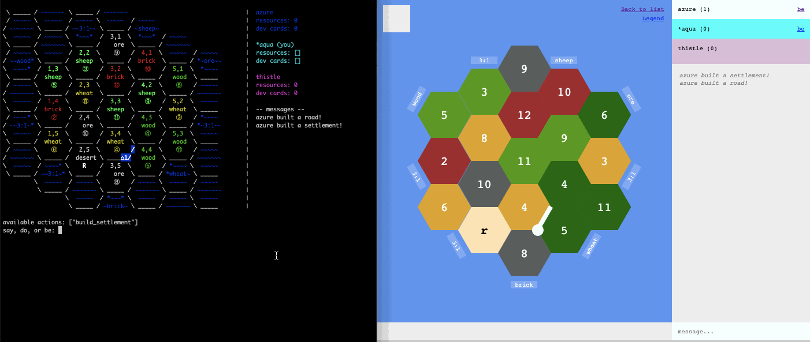

# Settlers

of Catan!

## Summary

This repository started off in 2011 as a way to teach myself Ruby, but it's morphed into a PORO-based implementation of Settlers of Catan with very hacky HTML and text-based web interfaces on top.

It supports multiple games and websocket-based board updates, but doesn't have any authentication or authorization logic, so any user can perform actions as any player (in any game). It's best for friendly play on a local network :)

## Demo

[It's deployed here,](https://ruby-settlers.herokuapp.com) or you can watch the following instructional GIF:

## Local Setup

1. Clone the repository,  `cd` into it
1. `bundle install`
1. `bundle exec puma -p 4567`
1. Visit `http://localhost:4567`
4. Or run `ruby text/client.rb` with a `GAME_URL`

To run tests, `ruby test.rb`

## License

[MIT](https://opensource.org/licenses/MIT)
